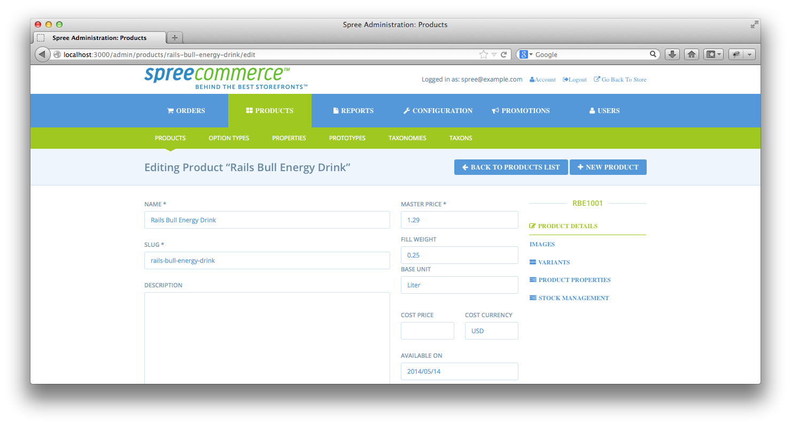
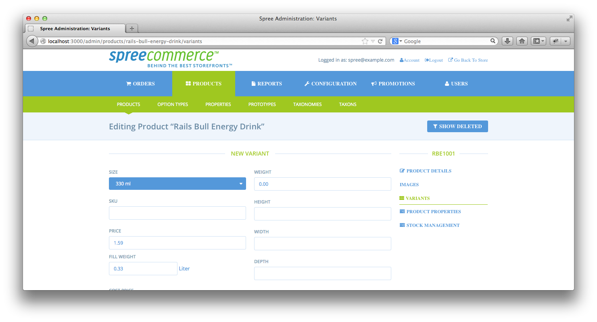
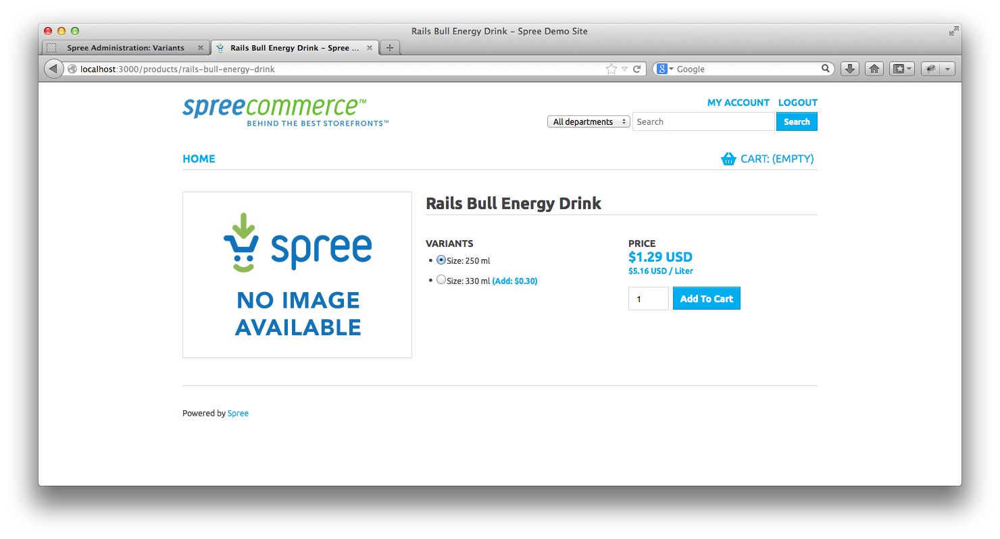

SpreeBasePrice
==============

This gem add a base price to your product. It's required for some counries in Europe, to show a price calculated for a round amout (e.g. 1 kilogramm) for a better comparison.

Installation
------------

Add spree_base_price to your Gemfile:

```ruby
gem 'spree_base_price'
```

Bundle your dependencies and run the installation generator:

```shell
bundle
bundle exec rails g spree_base_price:install
```

Make sure, that in your product.js.coffee file the javascript function Spree.updateVariantPrice contains the following lines:

    basePrice = variant.data('base_price')
    ($ '.price.base').text(basePrice) if basePrice

Usage
-----

First fill in a base unit for this product (e.g. Kilo, Liter, ...). You can also give a filling weight for this product



or you can give a filling weight for each variant:



In your shop you can see your base price under the normal price:




Testing
-------

First bundle your dependencies, then run `rake`. `rake` will default to building the dummy app if it does not exist, then it will run specs. The dummy app can be regenerated by using `rake test_app`.

```shell
bundle
bundle exec rake
```

When testing your applications integration with this extension you may use it's factories.
Simply add this require statement to your spec_helper:

```ruby
require 'spree_base_price/factories'
```

Copyright (c) 2014 Andreas Ofner, released under the New BSD License
